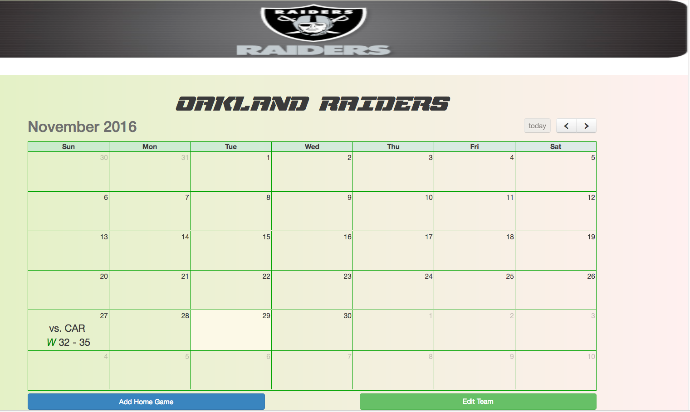

##Intro
Sports League App that allows commissioners to manage the league and managers to manage their teams.

##Client
Somebody like Bud Selig, but the most realistic clients are probably beer and little leagues.

##Tech
* HTML(.erb)/CSS: Basic Layout and Styling (with assistance from embedded Ruby - erb)

* Ruby on Rails
* Fullcalendar gem
* jQuery: to fully utilize the Fullcalendar gem

##Approach
Early on, I decided to do the styling on the last day as I wanted to have as much time as possible on the features. I decided to tackle the User first as it didn't 'belong to' anything, saving me at least one migration. Everything else was done in the order so that nothing had to be linked to something that didn't exist. Most of the stuff I wanted to do probably had been done before, so I looked at the source code of stuff I liked to see how things were done.

##Installation
Rails DB Setup after download. Bundle Installation may be required.

**User Stories:** [https://trello.com/b/0s6rAvpb/sportsleague](https://trello.com/b/0s6rAvpb/sportsleague)

**Wireframes:** [https://app.moqups.com/rulerofrakdos@gmail.com/rhNPXzWPt3/edit/page/adfa5d53e](https://app.moqups.com/rulerofrakdos@gmail.com/rhNPXzWPt3/edit/page/adfa5d53e)

**Database:** [http://dbdesigner.net/designer/schema/59368](http://dbdesigner.net/designer/schema/59368)

##Challenges
The fullcalendar was quite difficult to implement. I also had to undo 1 days of work to get the team->manager relationship to work properly and in the end I had to use the class_name feature of the rails model to make sure it won't mistake the commissioner of the league as its manager.

I still have not figured out how to update the features as Ajax and in the future I want to implement a customizable playoff model, which I expect will be quite difficult.
